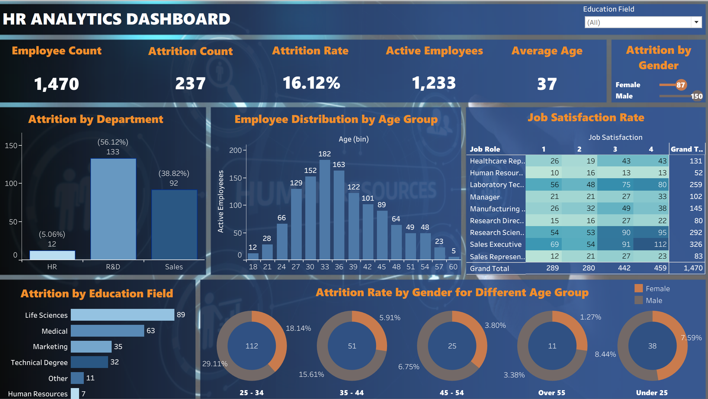

# HR Analytics Dashboard 
Built using Tableau to analyze employee attrition and workforce trends.

## 📊 Project Overview

 I built this dashboard to analyze employee attrition and workforce trends using Tableau. The dashboard provides insights into employee distribution, job satisfaction, and attrition patterns across different departments and age groups.

## 🔍 Key Insights

* Highest attrition observed in the R&D department
* Employees aged 25–34 show higher turnover
* Sales roles show comparatively lower job satisfaction levels

## 🛠 Tools Used

* Tableau
* Excel (Data Cleaning & Preparation)

## 📁 Dataset

The dataset contains employee information such as age, department, job role, education field, and attrition status.

## 📷 Dashboard Preview

## 📌 Learnings
- Improved data visualization skills using Tableau
- Gained understanding of HR analytics and attrition trends
