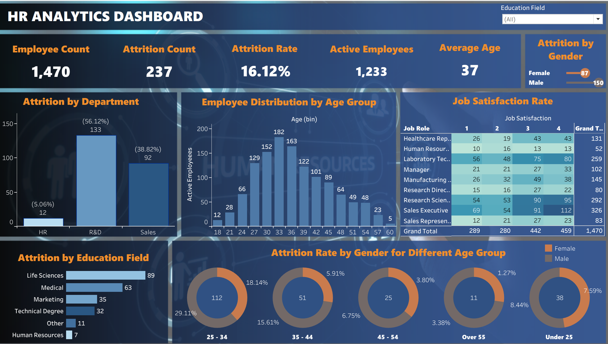

# 📊 HR Analytics Dashboard 
Analysed attrition data of 1,470 employees across 3 departments to identify turnover patterns and workforce trends using Tableau.

## 📊 Project Overview
This dashboard provides insights into employee attrition, job satisfaction, and workforce distribution across departments, age groups, and education fields.

## 🔍 Key Insights
- Overall attrition rate is 16.12% — 237 out of 1,470 employees left the organisation
- R&D department has the highest attrition (133 employees, 56.12%) — suggests retention issues in technical roles
- Employees aged 25–34 show the highest turnover (112 attritions, 29.11%) — indicating early career dissatisfaction
- Life Sciences education field accounts for the most attritions (89 employees)
- Males account for 150 attritions vs 87 females across all age groups

 ## 🛠 Tools Used
- Tableau
- Excel (Data Cleaning & Preparation)

## 📁 Dataset
Employee dataset containing information such as age, department, job role, education field, gender, and attrition status.

## 📷 Dashboard Preview

## 📌 Learnings
- Building interactive Tableau dashboards with filters and slicers
- Analysing HR metrics like attrition rate, job satisfaction, and age distribution
- Deriving actionable business insights from workforce data
